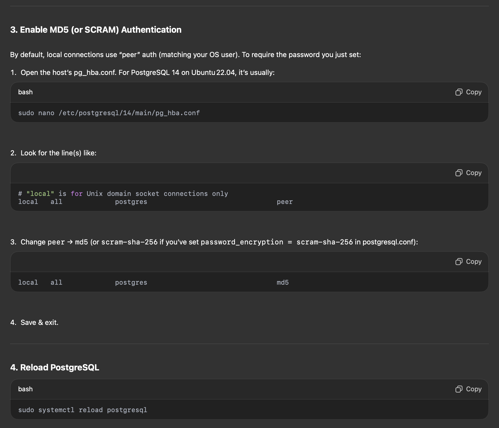
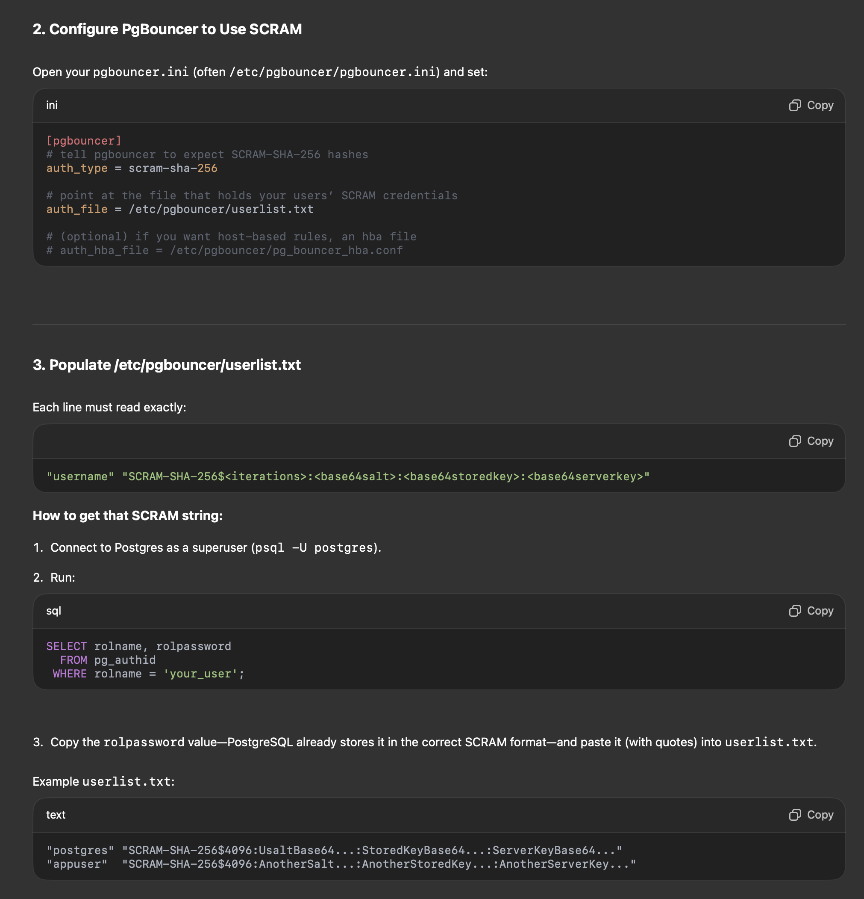
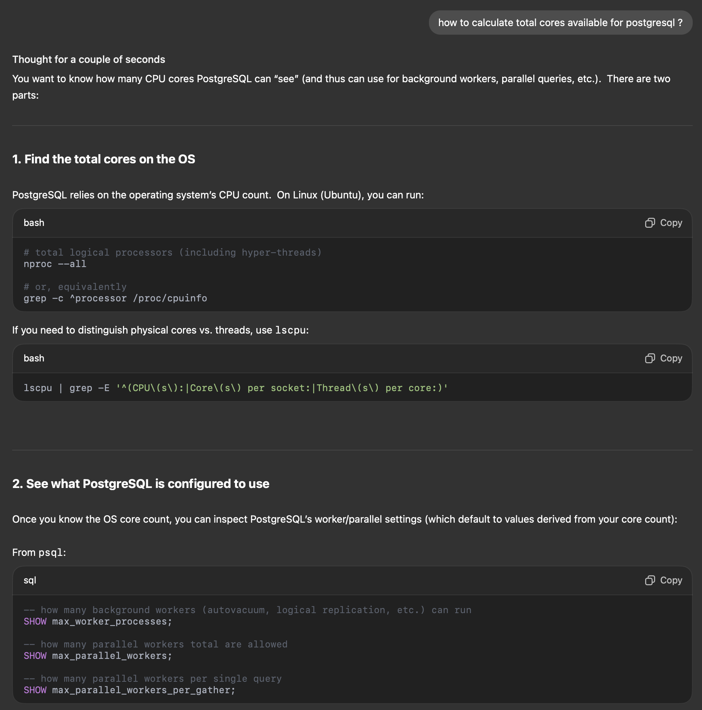
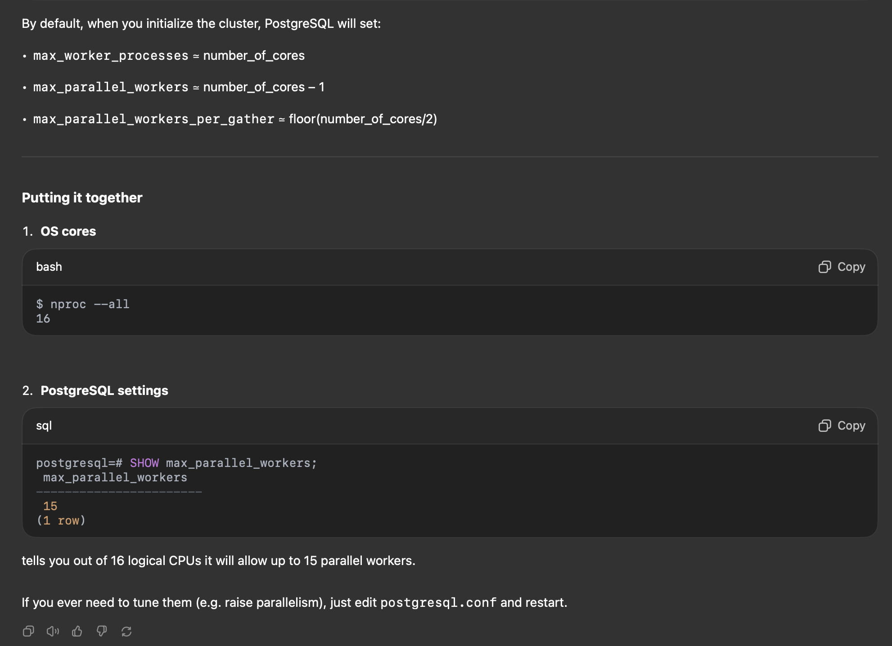

### PostgreSQL On Ubuntu 22.04

```bash
sudo apt update
sudo apt install -y postgresql postgresql-contrib
```

```
/etc/security/limits.conf
```

```
postgres  soft  nofile  65536
postgres  hard  nofile  65536
```

```
/etc/sysctl.d/99-postgresql.conf
```

```
kernel.shmmax = 17179869184      # e.g. 16 GB
kernel.shmall = 4194304          # total pages (16 GB/4 KB)
kernel.sem    = 250 32000 100 128
vm.swappiness = 10               # favor cache over swapping
vm.dirty_ratio = 15
vm.dirty_background_ratio = 5
fs.file-max = 2097152
net.core.somaxconn = 1024        # backlog queue
```

```
sudo sysctl --system
```

```
sudo apt install cpufrequtils
sudo cpufreq-set -g performance
```

```
/etc/postgresql/14/main/postgresql.conf
```

```
# CONNECTIONS & MEMORY
max_connections = 500               # how many clients you expect
superuser_reserved_connections = 5

shared_buffers = 4GB                # ~25% of RAM
effective_cache_size = 12GB         # ~75% of RAM
work_mem = 16MB                     # per-sort/work area
maintenance_work_mem = 1GB

# WRITE AHEAD LOG (durability vs throughput)
wal_level = replica
max_wal_size = 4GB
min_wal_size = 1GB
checkpoint_completion_target = 0.9
checkpoint_timeout = 15min

# QUERY PLANNER TUNING
default_statistics_target = 100
random_page_cost = 1.1
effective_io_concurrency = 200

# AUTOVACUUM
autovacuum = on
autovacuum_max_workers = 5
autovacuum_naptime = 1min
autovacuum_vacuum_scale_factor = 0.2
autovacuum_analyze_scale_factor = 0.1

# LOGGING (helpful for diagnosing contention)
log_min_duration_statement = 500      # log queries > 500 ms
log_checkpoints = on
log_autovacuum_min_duration = 0

# OPTIONAL: background writer tuning
bgwriter_lru_maxpages = 100
bgwriter_lru_multiplier  = 2.0
```

```
sudo systemctl restart postgresql
```

### Connection Pooling

```
sudo apt install -y pgbouncer
```

```
/etc/pgbouncer/pgbouncer.ini
```

```
[databases]
mydb = host=127.0.0.1 port=5432 dbname=mydb

[pgbouncer]
listen_addr = 0.0.0.0
listen_port = 6432
auth_type = md5
auth_file = /etc/pgbouncer/userlist.txt

pool_mode = session         ; or transaction
max_client_conn = 1000
default_pool_size = 50
reserve_pool_size = 20
reserve_pool_timeout = 5.0
```

Populate `/etc/pgbouncer/userlist.txt` with >

```
"postgres" "md5<encrypted-password>"
```

```
sudo systemctl enable pgbouncer
sudo systemctl restart pgbouncer
```

### How to generate MD5 password for pgbouncer

- If username = `alice` and password = `s3cr3t!`
- Then PG's MD5 Format is : `md5` + `md5( password + username )`

#### On Linux/macOS:

```
echo -n "s3cr3t!alice" | md5sum
# z123456

# Then prepend "md5":
md5z123456
```




### If it is default (SHA256)

```
# psql -h localhost -U postgres postgres

Password for user postgres:
psql (14.17 (Ubuntu 14.17-0ubuntu0.22.04.1))
SSL connection (protocol: TLSv1.3, cipher: TLS_AES_256_GCM_SHA384, bits: 256, compression: off)
Type "help" for help.

postgres=# show password_encryption;

password_encryption
---------------------
 scram-sha-256
(1 row)
```



```
postgres=# SELECT rolname, rolpassword from pg_authid where rolname = 'postgres';

 rolname  |                                                              rolpassword
+---------------------------------------------------------------------------------------------------------------------------------------
 postgres | SCRAM-SHA-256$4096:ddd+NCOCW<<<<REDACTED>>>>=
(1 row)
```

```
# secure the file
sudo chown pgbouncer:pgbouncer /etc/pgbouncer/userlist.txt
sudo chmod 600        /etc/pgbouncer/userlist.txt

# reload PgBouncer so it picks up the new auth settings
sudo systemctl reload pgbouncer
```

```
systemctl enable pgbouncer
```

```
systemctl enable postgresql
```





```
-- how many background workers (autovacuum, logical replication, etc.) can run
SHOW max_worker_processes;

-- how many parallel workers total are allowed
SHOW max_parallel_workers;

-- how many parallel workers per single query
SHOW max_parallel_workers_per_gather;
```

```
lscpu | grep -E '^(CPU\(s\):|Core\(s\) per socket:|Thread\(s\) per core:)'

CPU(s):                               44
Thread(s) per core:                   2
Core(s) per socket:                   22
```